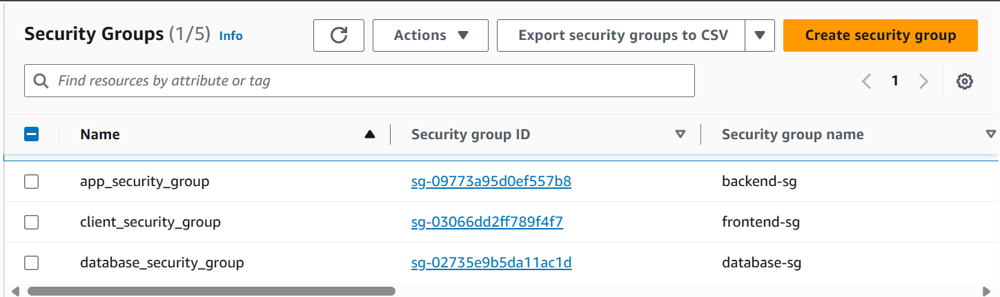

# AWS 3-TIER APPLICATION INFRASTRUCTURE

### Introduction
------------------

This project showcases the deployment of a highly scalable and resilient 3-tier architecture on AWS, fully automated using Terraform. The infrastructure includes everything from VPC configuration to fine-grained security rules, ensuring optimal performance and security. It is designed to support modern web applications with high availability and efficient resource management, making it ideal for dynamic workloads.

### Project Overview
---------------------

This project implements a robust 3-tier architecture designed for scalability, high availability, and security on AWS. The infrastructure consists of the following tiers:

* Frontend Tier (Public Subnet):
The frontend tier is deployed in a public subnet, utilizing an Application Load Balancer (ALB) to distribute incoming traffic efficiently across multiple instances. This ensures seamless user experience and redundancy. Auto Scaling is configured to dynamically adjust the number of instances based on workload

* Backend Tier (Private Subnet):
The backend tier operates in a secure private subnet, hosting the core business logic of the application. Auto Scaling is configured to dynamically adjust the number of instances based on workload. Instances in the backend tier access the internet securely through a NAT Gateway, which is deployed in the public subnet.

* Database Tier (Private Subnet):
The database tier resides in another private subnet, safeguarding sensitive data. Amazon RDS is used with built-in encryption to protect data at rest and in transit. Backups and automated failover capabilities further enhance data reliability.

### Key Features:
------------------

* High Availability:
The infrastructure spans multiple availability zones, providing redundancy and minimizing downtime in case of failures.

* Scalability:
Both the frontend and backend tiers leverage auto scaling. A CloudWatch alarm monitors CPU utilization and triggers scaling actions when usage exceeds or falls below predefined thresholds, ensuring performance and cost efficiency

* Enhanced Security:
Security Groups and IAM roles enforce strict access controls between tiers. Sensitive data is protected through encryption, and private subnets prevent unauthorized external access.

* State Management:
Terraform state is stored in a remote S3 backend, ensuring a secure and centralized location for managing the infrastructure state. This facilitates collaboration and provides state locking to prevent conflicts during deployments.

* Cost Optimization: 
The project is designed with cost efficiency in mind. Auto Scaling ensures that compute resources are only provisioned when necessary, scaling up during high traffic and scaling down during periods of low demand, minimizing costs. Additionally, most resources, such as the S3 backend, RDS, and EC2 instances, are configured to operate within the AWS Free Tier where possible, reducing operational expenses during the initial phases of development and testing.

    -- place diagram here --

### Project Structure
--------------------------

The project leverages an extensive modular structure to ensure scalability, reusability, and maintainability. Each module is designed to manage a specific part of the infrastructure, allowing for clear separation of concerns and simplified updates.

The project is organized into the following Terraform modules:
 
##### 1. VPC Module

The VPC Module is responsible for setting up the foundational networking infrastructure. It dynamically provisions resources based on the number of availability zones (AZs) specified in variables.tf, ensuring flexibility and scalability. The module includes the following components:

* **VPC** : Creates a Virtual Private Cloud to provide an isolated network environment for the application.
* **Subnets**: Dynamically provisions three types of subnets across all specified AZs using a for_each loop:
    * Public Subnets: For resources that require internet access (e.g., NAT Gateways, Load Balancers).
    * Private Subnets: For backend services that do not require direct internet access.
    * Database Subnets: Specifically designed for hosting RDS instances with no internet connectivity for added security.
* **Internet Gateway (IGW)**: Allows resources in the public subnets to communicate with the internet.
* **Elastic IP Addresses (EIPs)**: Allocates one Elastic IP for each AZ to ensure consistent internet-facing addresses for the NAT Gateways.
* **NAT Gateways**: Deploys one NAT Gateway per AZ in the public subnets. This allows instances in private and database subnets to initiate outbound internet connections securely (e.g., for updates).
* **Route Tables and Associations**: 
    * Public Route Table: Routes traffic from public subnets to the internet via the Internet Gateway.
    * Private Route Tables: Each private and database subnet is associated with its own route table, configured to route outbound traffic through the respective NAT Gateway in the corresponding AZ.

* **Outputs**:
The VPC Module outputs the following IDs to be used by other modules:
- VPC ID: Enables other modules (e.g., compute, database) to attach resources to the same VPC.
- Subnet IDs: Provides the IDs of public, private, and database subnets for other modules to place their resources in the appropriate network segments.

##### 2. Security Module

The Security Module is designed to enforce strict access controls and ensure the overall security of the infrastructure. It adheres to the principle of least privilege, providing only the necessary access for each tier of the architecture. The module includes the following components:

* **SSH Public Key Management**
A public SSH key is securely managed using sensitive variables, ensuring that only authorized personnel can access the system for maintenance or troubleshooting.
This key is primarily intended for secure access to instances in case of emergencies or manual interventions.
* **Security Groups**: The module defines three distinct security groups to segment traffic between tiers
    * Frontend Security Group: Allows inbound traffic on HTTP/HTTPS ports (80, 443) from the internet and permits communication with the backend tier.
    * Backend Security Group: Restricts inbound traffic to only allow requests from the frontend tier on the appropriate application ports (e.g., 8080, 3000). It also allows outbound traffic to the database tier for data queries.
    * Database Security Group: Permits inbound traffic exclusively from the backend tier on the database port (e.g., 3306 for MySQL or 5432 for PostgreSQL). This security group blocks any direct external access to the database.
* **Security Group Rules**: Separate Implementation of Rules
Security group rules are implemented as separate resources to avoid Terraform cycle errors. This approach ensures smooth dependency management while maintaining strict control over network traffic.
* **Tightly Restricted Rules** : Each rule is carefully crafted to allow only the minimum required access
    - Frontend Tier: Inbound HTTP/HTTPS from the internet; outbound to backend.
    - Backend Tier: Inbound and Outbound to and from frontend/Database.
    - Database Tier: Inbound and Outbound to and from backend only; no outbound internet access.

* **Key Highlights**:
- Principle of Least Privilege: Ensures minimal access between tiers, reducing the risk of unauthorized access.
- Cycle-Free Implementation: By decoupling security group rules from the security group definitions, the module avoids Terraform dependency cycles.
- Sensitive Data Protection: SSH public keys are managed securely, preventing accidental exposure.

##### 3. Compute Module

The Compute Module handles the deployment of scalable and resilient compute resources, ensuring optimal performance for both the frontend and backend tiers. The module includes the following components:

* **Elastic Load Balancers (ELBs)**
Two Application Load Balancers (ALBs) are deployed to manage traffic distribution:
    Frontend Load Balancer: Distributes incoming HTTP/HTTPS traffic to frontend instances.
    Backend Load Balancer: Balances traffic between backend instances, improving reliability and performance.

* **Launch Templates**
Separate Launch Templates are defined for frontend and backend instances to standardize instance configurations (AMI, instance type, key pairs, etc.) and ensure consistent provisioning.

* **Auto Scaling Groups (ASGs)**
Two ASGs are configured (one for each tier) to manage instance scaling dynamically. They ensure high availability by distributing instances across multiple AZs.
ASGs are integrated with load balancers to handle traffic routing and health checks automatically.

* **Auto Scaling Policies**
Policies are defined to scale up or down based on CPU utilization, ensuring efficient use of resources:
    Scale-Up Policy: Triggers when CPU usage exceeds a predefined threshold.
    Scale-Down Policy: Triggers when CPU usage falls below a specified threshold.

* **CloudWatch Metric Alarms**
CloudWatch Alarms monitor the CPU utilization of instances in the ASGs. These alarms trigger the auto scaling policies to ensure the infrastructure adapts to changing workloads:
    High CPU Alarm: Activates the scale-up policy.
    Low CPU Alarm: Activates the scale-down policy.

##### 4. Database Module
The Database Module provisions a managed RDS instance and ensures the proper networking setup for secure database access within the infrastructure. The module uses a DB Subnet Group to place the RDS instance within the private subnet for added security. The module includes the following components:

* **RDS Instance** 
RDS Instance: A fully managed relational database service is provisioned for the backend tier to store application data (e.g., MySQL, PostgreSQL). This instance is placed within the private subnet for security, ensuring it is not directly accessible from the internet.
* **DB Subnet Group**
The DB Subnet Group is defined to specify which subnets the RDS instance should be deployed into. The group uses subnets within the private subnet for security, ensuring that the database can only be accessed by other resources within the private network (e.g., backend instances).
* **Sensitive Variables for Database Credentials**
DB Username and Password: Both the database username and password are treated as sensitive variables to ensure security. These credentials are securely stored in separate tfvars files and are never hardcoded within the Terraform configuration. This practice ensures that sensitive information remains protected and is securely managed throughout the infrastructure lifecycle.

Key Highlights:
- Security-Focused Deployment: By placing the RDS instance in a private subnet and restricting access through security groups, the module ensures that sensitive data is isolated from the public internet.
- Sensitive Data Management: The use of sensitive variables for the database credentials ensures that sensitive information is kept secure and is not exposed in version control.
- Simplified Database Management: The RDS service automates patching, backups, and scaling, allowing you to focus on application logic instead of database maintenance.

##### 5. Root Directory Structure
------------------------

The root directory of the Terraform project organizes the main configuration, sensitive variables, and references to all the modules used in the infrastructure. The structure ensures modularity, reusability, and security, while maintaining clarity. The main components are as follows:

* **provider.tf**
This file configures the provider for AWS (or other cloud providers if needed), defining the credentials, region, and other necessary settings required to interact with AWS resources.

* **Provider Configuration**
Defines the AWS provider and configures the region and any other provider-specific settings.

* **Backend Configuration (for S3 tfstate)**
The backend configuration is set up to store the Terraform state in an S3 bucket, ensuring that the state is shared and managed securely in a remote location. It also supports state locking via DynamoDB to prevent race conditions during concurrent Terraform runs.

* **main.tf**
This is the main entry point where all the individual modules are referenced and instantiated. It pulls in all the previously defined modules and configures them to create the full infrastructure stack.

* **prod.tfvars (Sensitive Variables)**
The prod.tfvars file stores sensitive information, such as database credentials and any other secrets. This file is not checked into version control to ensure security.

'''
    ├── provider.tf
    ├── main.tf
    ├── variables.tf
    ├── prod.tfvars
    ├── modules
    │   ├── vpc
    │   ├── security
    │   ├── compute
    │   ├── database
'''

## Prerequisites
----------------------

List necessary tools and accounts:
Terraform (include version)
Cloud provider CLI (e.g., AWS CLI)
An active account with the cloud provider
Access to specific services (e.g., IAM roles, S3 for state management)

## Usage
-------------------

Clone the Repository:
git clone <repository-url>
cd <repository-folder>
Initialize Terraform:

bash
Copier le code
terraform init
Plan the Infrastructure:

bash
Copier le code
terraform plan -var-file=prod.tfvars
Apply the Changes:

bash
Copier le code
terraform apply -var-file=prod.tfvars
Destroy the Infrastructure (if needed):

bash
Copier le code
terraform destroy -var-file=prod.tfvars

Outputs
Public IPs and DNS of ALBs.
RDS Endpoint for the database.
Auto Scaling Group details.

## BEST PRACTICES 
-----------------------

Include any relevant practices:

Use remote state for collaboration.
Manage secrets securely (e.g., AWS Secrets Manager)

All sensitive credentials are stored in encrypted files (prod.tfvars).
Least privilege principles applied for IAM roles.
Network segmentation via security groups and subnets.

## Troubleshooting
----------------------------
Provide solutions to common issues:

Error: Error: Cycle detected in module dependencies
Solution: Check for circular dependencies in your module configurations.

## Monitoring and Logging
------------------------------

CloudWatch Alarms: Monitors CPU utilization to trigger auto-scaling policies.
CloudWatch Logs: Collects logs for debugging and performance analysis.

## Future Improvements
-----------------------------
Implement Terraform Cloud for collaboration.
Add WAF for enhanced security on ALBs.
Integrate Prometheus and Grafana for advanced monitoring.

## License
------------------------
This project is open-source and available under the MIT License.

