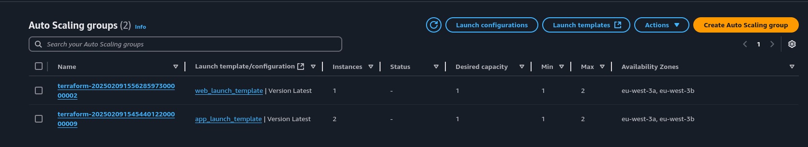
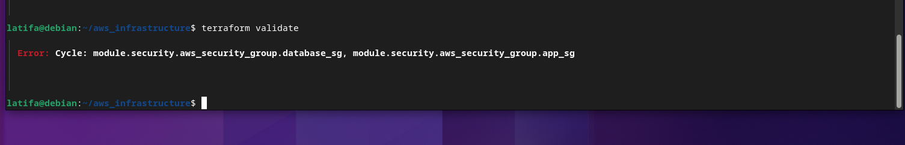
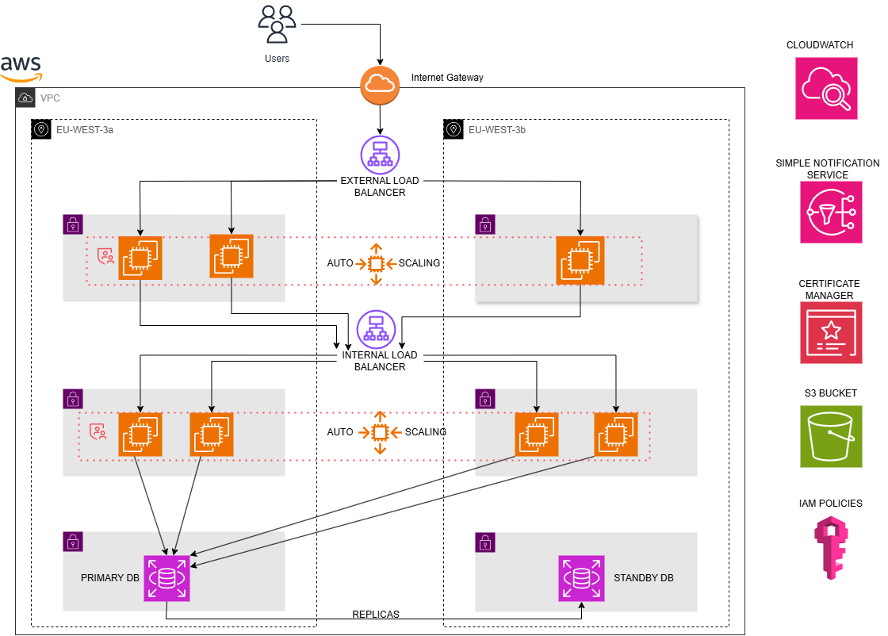

# AWS 3-TIER APPLICATION INFRASTRUCTURE


### Introduction
------------------

This project demonstrates the deployment of a robust, highly scalable, and efficient 3-tier architecture on AWS, fully automated with Terraform.
Designed to support modern web applications, it ensures high availability, optimal performance, and efficient resource utilization, making it well-suited for dynamic and demanding workloads.


### Project Overview
---------------------

The architecture of the project is composed of the following tiers:

* Presentation Tier (Web Tier): 
Hosts the front-end application in a public subnet, enabling user interaction through a web interface.

* Application Tier (Logic Tier): Deployed in a private subnet, this tier processes business logic and handles communication between the front-end and the database.

* Database Tier (Data Tier): Also in a private subnet, this tier securely manages and stores application data using Amazon RDS.


### Key Features:
------------------

* High Availability:
The infrastructure spans multiple availability zones, providing redundancy and minimizing downtime in case of failures.

* Scalability:
Both the frontend and backend tiers leverage auto scaling. A CloudWatch alarm monitors CPU utilization and triggers scaling actions when usage exceeds or falls below predefined thresholds, ensuring performance and cost efficiency

* Enhanced Security:
Security Groups and IAM roles enforce strict access controls between tiers. Sensitive data is protected through encryption, and private subnets prevent unauthorized external access.

* State Management:
Terraform state is stored in a remote S3 backend, ensuring a secure and centralized location for managing the infrastructure state. This facilitates collaboration and provides state locking to prevent conflicts during deployments.

* Cost Optimization: 
The project is designed with cost efficiency in mind. Auto Scaling ensures that compute resources are only provisioned when necessary, scaling up during high traffic and scaling down during periods of low demand, minimizing costs. Additionally, most resources, such as the S3 backend, RDS, and EC2 instances, are configured to operate within the AWS Free Tier where possible, reducing operational expenses during the initial phases of development and testing.


### Project Structure
--------------------------

The project leverages an extensive modular structure to ensure scalability, reusability, and maintainability. Each module is designed to manage a specific part of the infrastructure, allowing for clear separation of concerns and simplified updates.

The project is organized into the following Terraform modules:
 
##### 1. VPC Module

The VPC Module is responsible for setting up the foundational networking infrastructure. It dynamically provisions resources based on the number of availability zones (AZs) specified in variables.tf, ensuring flexibility and scalability. The module includes the following components:

* **VPC** : Creates a Virtual Private Cloud to provide an isolated network environment for the application.
* **Subnets**: Dynamically provisions three types of subnets across all specified AZs using a for_each loop:
    * Public Subnets: For resources that require internet access (e.g., NAT Gateways, Load Balancers).
    * Private Subnets: For backend services that do not require direct internet access.
    * Database Subnets: Specifically designed for hosting RDS instances with no internet connectivity for added security.
* **Internet Gateway (IGW)**: Allows resources in the public subnets to communicate with the internet.
* **Route Tables and Associations**: 
    * Public Route Table: Routes traffic from public subnets to the internet via the Internet Gateway.
    * Private Route Tables: Each private and database subnet is associated with its own route table, configured to route outbound traffic through the respective NAT Gateway in the corresponding AZ.

##### 2. Security Module

The Security Module is meticulously designed to enforce strict access controls and safeguard the overall security of the infrastructure. By adhering to the principle of least privilege, it ensures that each tier in the architecture has only the access it requires, minimizing the risk of unauthorized activity.
This module includes the following key components:
* **Security Groups**:The module defines distinct security groups to control traffic between the tiers effectively:
    * External Load Balancer Security Group :
        - Hosts the external load balancer.
        - Allows inbound traffic from the internet on port 443 for secure communication using an ACM certificate.
    * Frontend Security Group: 
        - Allows inbound traffic on port 80 (HTTP) from the external load balancer.
        - Permits outbound traffic to the backend tier for seamless communication.
    * Internal Load Balancer Security Group : 
        - Hosts the internal load balancer.
        - Accepts traffic from the frontend tier and forwards it to the backend tier.
    * Backend Security Group: 
        - Receives traffic from the internal load balancer.
        - Allows outbound traffic to the database tier for executing data queries.
    * Database Security Group: 
        - Restricts inbound traffic to the backend tier on the database port (e.g., 3306 for MySQL or 5432 for PostgreSQL).
        - Blocks all direct external access to the database, ensuring maximum protection.

* **Security Group Rules**: Separate Implementation of Rules
Security group rules are implemented as separate resources to avoid Terraform cycle errors. This approach ensures smooth dependency management while maintaining strict control over network traffic.


* **Key Highlights**:
- Principle of Least Privilege: Ensures minimal access between tiers, reducing the risk of unauthorized access.
- Cycle-Free Implementation: By decoupling security group rules from the security group definitions, the module avoids Terraform dependency cycles.
- Sensitive Data Protection: SSH public keys are managed securely, preventing accidental exposure.


##### 3. Compute Module

The Compute Module is responsible for deploying scalable and resilient compute resources, ensuring optimal performance and reliability across both the frontend and backend tiers. It incorporates the following key components:


* **Application Load Balancers (ALB)**
Two Application Load Balancers (ALBs) are deployed to manage traffic distribution:
    * External Load Balancer: Distributes incoming traffic to frontend instances, ensuring high availability for the presentation tier.
    * FInternal Load Balancer: Balances traffic between backend instances, improving performance and reliability for the application tier.


* **Launch Templates**
Separate Launch Templates are defined for frontend and backend instances to standardize instance configurations (AMI, instance type, userdata, etc.) and ensure consistent provisioning.

* **Auto Scaling Groups (ASGs)**
Two Auto Scaling Groups (ASGs) are configured—one for the frontend and one for the backend—to handle dynamic instance scaling. Key features include:
    - High availability through instance distribution across multiple Availability Zones (AZs).
    - Seamless integration with ALBs to manage traffic routing and automated health checks.



* **Auto Scaling Policies**
Auto Scaling Policies ensure efficient resource utilization by dynamically adjusting the number of instances based on CPU usage:

    - Scale-Up Policy: Adds instances when CPU utilization exceeds the predefined threshold to handle increased workload.
    - Scale-Down Policy: Removes instances when CPU utilization drops below the specified threshold, optimizing costs during low traffic periods.

    

##### 4. Monitoring Module 
The Monitoring Module ensures the infrastructure operates efficiently and reliably by providing real-time insights and proactive alerts. It leverages Amazon CloudWatch to track key metrics and trigger automated actions or notifications when thresholds are breached.

* **CloudWatch Metrics and Alarms**
The module defines CloudWatch metrics and alarms to monitor critical resources and take action as needed:

* CPU Utilization Alarms:
    - Monitors the CPU usage of instances in the frontend and backend tiers.
    - Triggers Scale-Up or Scale-Down policies in the Compute Module based on predefined thresholds, ensuring optimal resource utilization and cost efficiency.

* Database Storage Alarm:
    - Tracks the storage usage of the database tier.
    - sends an email notification to the team when the storage usage reaches a critical threshold, allowing timely intervention to avoid downtime or data loss.


* **Key Highlights**
    - Proactive Resource Management: Automatically scales compute resources up or down based on workload demands to ensure seamless application performance.
    - Early Problem Detection: Alerts the team before critical issues arise, such as database storage nearing capacity.
    - Efficient Notifications: Email alerts ensure that the team is promptly informed of any potential issues requiring manual intervention.

##### 5. IAM Module
The IAM Module is designed to enforce secure and granular access control across the infrastructure, ensuring that permissions are both restricted and tailored to specific needs. By following the principle of least privilege, it grants only the necessary access to resources while maintaining flexibility for team operations.

* **Instance-Level Access**
    IAM Policy for Backend Instances:
    - A custom IAM policy is created to allow backend instances to securely access the RDS database.
    IAM Role for Backend Instances:
    - An IAM role is associated with backend instances, enabling them to assume the policy for seamless database interaction without exposing credentials.

* **Team-Level Access**
    -  SNS Topic Creation:
    An SNS topic is configured to facilitate centralized notifications, such as database storage alerts from the Monitoring Module.
    - IAM Policy for Team Access:
    A policy is created to grant full RDS access to the team, enabling efficient database management.
    - IAM Group Configuration:
    The IAM policy is attached to an IAM group, allowing team members to inherit permissions securely and efficiently through their group membership.

  

* **Key Highlights**
    - Secure Resource Access: Backend instances securely access the database without hardcoded credentials, reducing security risks.
    - Granular Team Permissions: The IAM group ensures that only authorized team members can manage RDS resources.
    - Centralized Notifications: The SNS topic integrates seamlessly with monitoring alarms, keeping the team informed of critical updates.

This module strengthens infrastructure security and streamlines resource access management, ensuring both operational efficiency and robust protection.

##### 6. Database Module
The Database Module provisions a secure and managed RDS instance to support the backend tier, ensuring reliable data storage and secure access within the infrastructure.

* **RDS Instance**
    - A fully managed relational database service (e.g., MySQL, PostgreSQL) is deployed in the private subnet for enhanced security, preventing direct internet access.

* **DB Subnet Group**
    - Specifies private subnets for the RDS deployment, ensuring the database is only accessible by resources within the private network, such as backend instances.

* **Secure Database Credentials**
    - The database username and password are managed as sensitive variables, stored securely in tfvars files to prevent exposure in Terraform configurations.


### 5. Terraform Project Structure
------------------------
This Terraform project is designed with modularity and scalability in mind, enabling efficient management of resources while ensuring disaster recovery is seamless. By organizing configurations into reusable modules, the project promotes clarity, reusability, and adaptability. This structure allows for quick recovery and scaling, as each component can be modified or redeployed independently without affecting the entire system.

```
├── compute
│   ├── main.tf, variables.tf, output.tf
├── database
│   ├── main.tf, variables.tf, output.tf
├── iam
│   ├── main.tf, variables.tf, output.tf
├── monitoring
│   ├── main.tf, variables.tf, output.tf
├── security
│   ├── main.tf, variables.tf, output.tf
├── vpc
│   ├── main.tf, variables.tf, output.tf
├── main.tf              # Root main.tf referencing all modules
├── provider.tf          # Provider configuration (AWS)
├── variables.tf         # Global variables used across modules
├── prod.tfvars          # Sensitive variable values (password,credentials)

```
## Prerequisites
----------------------

List necessary tools and accounts:

- Terraform (include version)
- Cloud provider CLI (e.g., AWS CLI)
- An active account with the cloud provider
- Access to specific services (e.g., IAM roles, S3 for state management)

## Usage
-------------------

[Clone the Repository]:
```
git clone https://github.com/latifab7/aws_3tiers_infrastructure.git

```

[Initialize Terraform]:

`terraform init`

[Plan the Infrastructure]:

`terraform plan -var-file=prod.tfvars`

[Apply the Changes]:

`terraform apply -var-file=prod.tfvars`


[Destroy the Infrastructure (if needed)]:

`terraform destroy -var-file=prod.tfvars`


## BEST PRACTICES 
-----------------------

This project adheres to key best practices to ensure security, scalability, and efficient collaboration. Remote state storage is used to facilitate team collaboration and maintain a single source of truth. Sensitive credentials are securely managed using encrypted files (e.g., prod.tfvars) and AWS Secrets Manager to protect critical information. The principle of least privilege is strictly applied to security groups rules. Additionally, the infrastructure employs network segmentation through security groups and subnets, enhancing security by isolating different tiers and restricting unnecessary access.

## Troubleshooting
----------------------------
Issue: Cycle Detected in Security Groups
When applying the Terraform configuration, the following error appeared:



Cause:
This error arises when two security groups reference each other in their ingress rules, creating a circular dependency. Terraform cannot determine which security group should be created first, resulting in a cycle error.

Solution:
To resolve this, it’s essential to separate the creation of security groups from the assignment of their rules.

First, create the security groups without any rules that introduce dependencies.
Next, define the security group rules separately, referencing the already created security groups.
By doing this, Terraform can create the security groups independently, and then apply the dependent rules afterward, avoiding the cycle error.

This approach ensures that all security groups are created before any interdependent rules are applied, breaking the circular dependency and allowing the configuration to be applied successfully.


## Future Improvements
-----------------------------
- [ ] Adopt Terraform Cloud to enhance collaboration, streamline state management, and enable features like policy enforcement and change notifications.
- [ ] Integrate AWS WAF with the Application Load Balancers (ALBs) to provide advanced security by protecting against common web exploits and attacks.
- [ ] Incorporate Prometheus and Grafana for comprehensive monitoring and visualization, enabling proactive performance management and incident response.
- [ ] Enhance IAM Role Implementation by applying the principle of least privilege more effectively, ensuring that resources only have access to the permissions necessary for their specific tasks.

## Diagram



## License
------------------------
This project is open-source and available under the MIT License.

